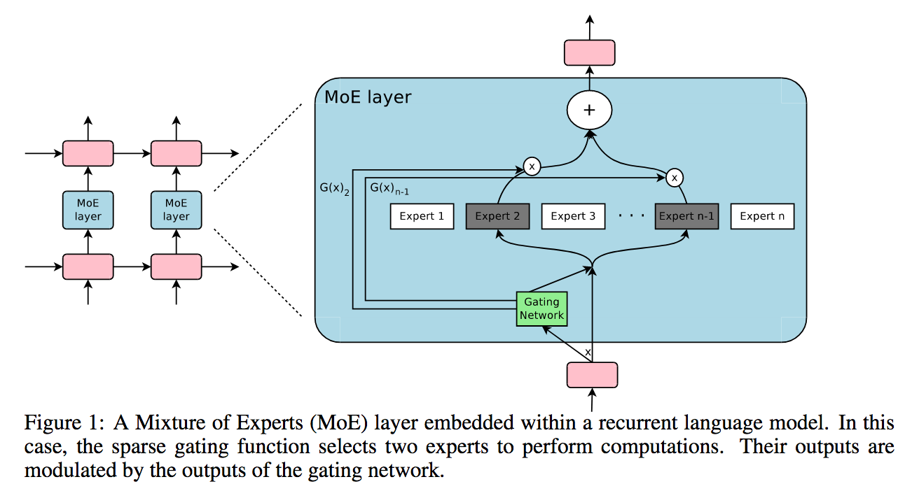

# MoE PyTorch

  

PyTorch implementation of Sparsely-Gated Mixture-of-Experts (MoE).

[MoE](https://arxiv.org/abs/1701.06538) - Outrageously Large Neural Networks: The Sparsely-Gated Mixture-of-Experts Layer.
